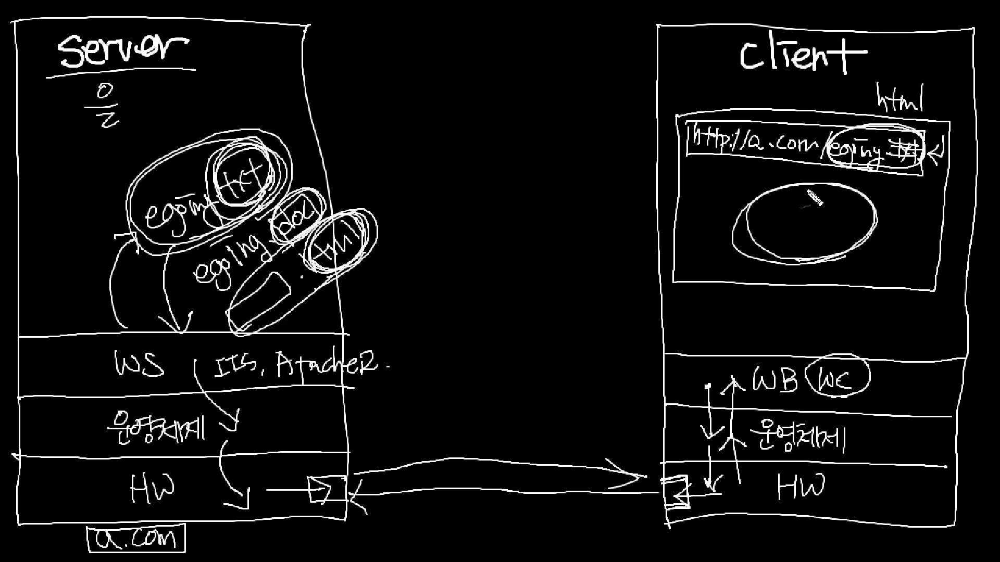
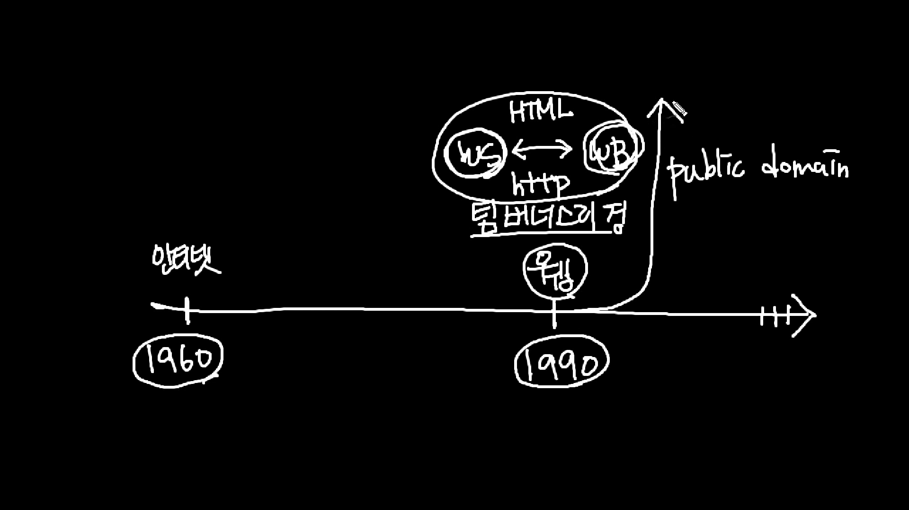

2022-03-13 (일) 흐림 비옴

( 웹 과 인터넷은 같은 개념이 아니다 Web ≠ Internet )

DB에 있는 정보를 html&css 에 넣으려면 어떻게 해야하는가에 대한 개념이 없다고 판단이 들었다

해서 , 웹의 구조에 대해 파악하고자 알아보기 시작했다

( 참고자료 : https://www.youtube.com/watch?v=7ujWkFyw01g
          : https://www.youtube.com/watch?v=70bzGTx-BHo&t=137s
)

[로컬서버]

로컬mysql 을 로컬 웹페이지랑 연동하기 위해서 

bitnami

웹 애플리케이션, 개발 스택용 소프트웨어 패키지 및 설치 라이브러리. apache, php, mysql 을 통합설치

사용.

**윈도우 wamp** — 

**맥 mamp** — 

**리눅스 lamp** — 

